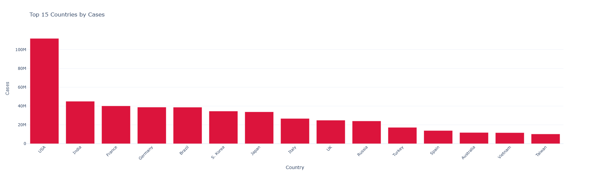
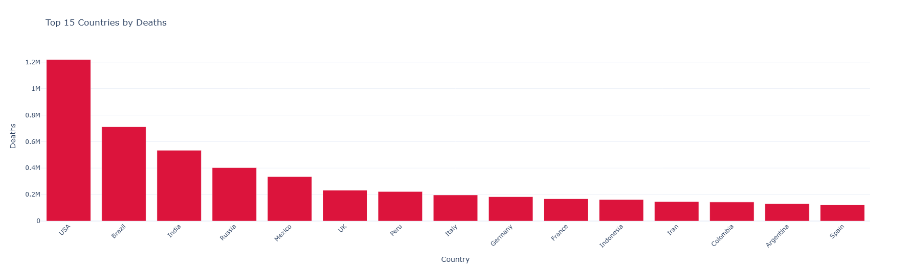
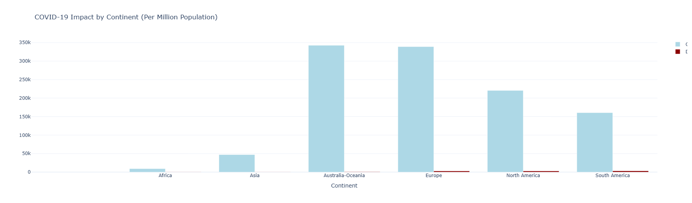
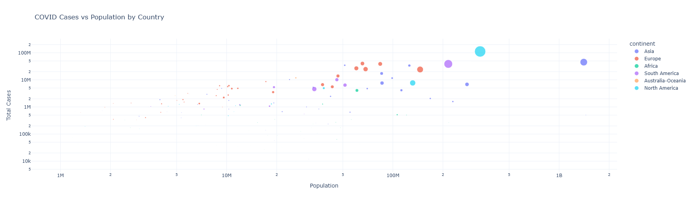

# 🦠 COVID-19 Global Data Analysis

A comprehensive Python-based analysis tool for visualizing and understanding global COVID-19 trends, impact patterns, and statistical insights. This project demonstrates advanced data fetching, processing, and multi-dimensional visualization capabilities using real-time global health data.

## 🚀 Features

- **Real-time global COVID data** fetching from disease.sh API
- **Multi-dimensional analysis** across countries, continents, and population metrics
- **Interactive comparative visualizations** with hover details and zoom capabilities
- **Statistical summary generation** with key global health metrics
- **Population-normalized analysis** for fair cross-country comparisons
- **Continental trend analysis** showing regional impact patterns
- **Professional data visualization** with consistent styling and clear insights

## 🌍 Data Sources

- **Primary API**: [disease.sh](https://disease.sh) - Reliable, frequently updated global COVID-19 statistics
- **Coverage**: 195+ countries and territories worldwide
- **Metrics**: Cases, deaths, recoveries, active cases, population-normalized rates
- **Update Frequency**: Real-time data with daily updates

## 📊 Sample Visualizations

### Top Countries by Total Cases

*Interactive bar chart showing the 15 most affected countries by total confirmed cases*

### Top Countries by Deaths

*Comparative analysis of countries with highest death tolls*

### Continental Impact Analysis

*Population-normalized comparison showing cases and deaths per million by continent*

### Population vs Cases Scatter Analysis

*Bubble chart analyzing the relationship between population size and COVID impact, with bubble size representing deaths and colors indicating continents*

## 🛠️ Technologies Used

- **Python 3.7+** - Core programming language
- **pandas 2.1.3** - Data manipulation, cleaning, and statistical analysis
- **plotly 5.17.0** - Interactive data visualization and charting
- **requests 2.31.0** - HTTP library for API data fetching
- **disease.sh API** - Real-time COVID-19 global data source

## ⚡ Quick Start

### Prerequisites
- Python 3.7 or higher installed
- Active internet connection for real-time data fetching

### Installation & Usage

1. **Clone the repository:**
   ```bash
   git clone https://github.com/ehzl1234/Data-Visualization-Projects.git
   cd Data-Visualization-Projects/data/covid_analysis
   ```

2. **Install dependencies:**
   ```bash
   pip install -r requirements.txt
   ```

3. **Run the analysis:**
   ```bash
   python covid_analysis.py
   ```

4. **View results:** 
   - Global summary statistics appear in terminal
   - 4 interactive charts automatically open in your browser
   - Charts support zooming, panning, and detailed hover information

### Alternative: Run in Google Colab
For immediate testing without local setup:
1. Open [Google Colab](https://colab.research.google.com)
2. Install dependencies: `!pip install pandas plotly requests`
3. Copy and paste the analysis code
4. Run and view interactive results instantly!

## 📁 Project Structure

```
covid_analysis/
├── covid_analysis.py           # Main analysis script with all functions
├── requirements.txt           # Python package dependencies
├── README.md                 # Project documentation (this file)
├── covid_cases_by_country.png    # Sample output: Top countries by cases
├── covid_deaths_by_country.png   # Sample output: Top countries by deaths
├── covid_by_continent.png        # Sample output: Continental analysis
└── covid_population_scatter.png  # Sample output: Population correlation
```

## 📈 Analysis Components

### 1. Data Acquisition
- **API Integration**: Fetches live data from disease.sh endpoint
- **Data Validation**: Handles API errors and ensures data quality
- **Multi-metric Collection**: Gathers cases, deaths, recoveries, and population data

### 2. Statistical Processing
- **Global Aggregation**: Calculates worldwide totals and rates
- **Continental Grouping**: Summarizes data by geographic regions
- **Population Normalization**: Computes per-million rates for fair comparison
- **Trend Analysis**: Identifies patterns across different metrics

### 3. Visualization Suite
- **Comparative Bar Charts**: Top-performing countries by various metrics
- **Grouped Analysis**: Continental comparisons with multiple variables
- **Correlation Scatter Plots**: Population vs. impact analysis with multi-dimensional encoding
- **Interactive Features**: Hover details, zoom capabilities, and responsive design

### 4. Insights Generation
- **Global Summary**: Key worldwide statistics and rates
- **Regional Patterns**: Continental impact differences
- **Population Effects**: How country size correlates with COVID spread
- **Severity Analysis**: Death rates and recovery patterns

## 🎯 Key Insights Revealed

- **Geographic Disparities**: Visualize how COVID-19 affected different regions unequally
- **Population Density Effects**: Understand the relationship between population size and infection rates
- **Healthcare System Performance**: Compare death rates across countries and continents
- **Recovery Patterns**: Analyze global recovery trends and regional differences
- **Normalized Comparisons**: Fair assessment using per-million population metrics

## 🔮 Future Enhancements

- [ ] **Time Series Analysis** - Historical trend visualization over time
- [ ] **Vaccination Data Integration** - Include vaccination rates and efficacy analysis
- [ ] **Economic Impact Correlation** - Link health data with economic indicators
- [ ] **Predictive Modeling** - Forecast future trends using machine learning
- [ ] **Interactive Web Dashboard** - Streamlit-based web interface for exploration
- [ ] **Automated Reporting** - Generate PDF reports with scheduled updates
- [ ] **Geographic Heat Maps** - World map visualizations with intensity mapping
- [ ] **Demographic Analysis** - Age and gender-based impact studies

## 🔗 API Reference

**Base URL**: `https://disease.sh/v3/covid-19/countries`

**Response Format**: JSON array of country objects
```json
{
  "country": "USA",
  "cases": 103436829,
  "deaths": 1127152,
  "recovered": 101344976,
  "population": 331893745,
  "continent": "North America"
}
```

## 🎮 Customization Options

**Modify Top Countries Count:**
```python
cases_chart = create_top_countries_chart(df, 'cases', 20)  # Show top 20
```

**Change Analysis Metrics:**
```python
deaths_chart = create_top_countries_chart(df, 'deathsPerOneMillion', 10)
```

**Filter by Continent:**
```python
asia_data = df[df['continent'] == 'Asia']
asia_chart = create_top_countries_chart(asia_data, 'cases', 15)
```

## 🤝 Contributing

Contributions are welcome! Areas where enhancements would be particularly valuable:

- **Additional Data Sources**: Integration with WHO, CDC, or other health APIs
- **Advanced Analytics**: Machine learning models for trend prediction
- **Performance Optimization**: Faster data processing for larger datasets
- **Visualization Improvements**: New chart types and interactive features
- **Documentation**: Additional examples and use case demonstrations

## 📊 Data Accuracy & Limitations

- **Data Source Reliability**: Uses disease.sh which aggregates from Johns Hopkins, WHO, and government sources
- **Update Frequency**: Data typically updates daily, with some regional delays
- **Reporting Variations**: Different countries may have varying reporting standards
- **Population Data**: Based on latest available census and UN estimates

## 📝 License

This project is open source and available under the [MIT License](LICENSE).

---

**Built with ❤️ for global health awareness and data science education**

*Last updated: Real-time data fetching ensures current information on every run*
