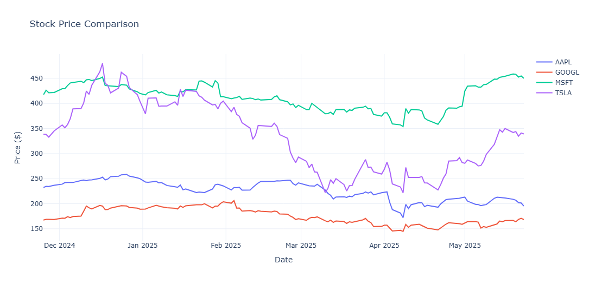
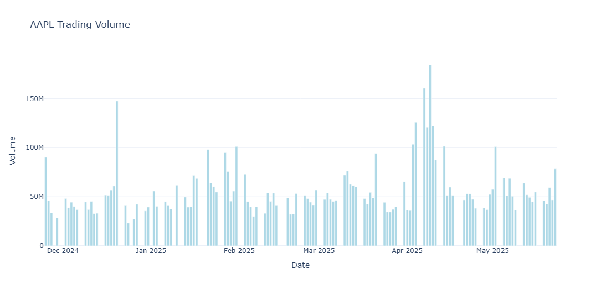
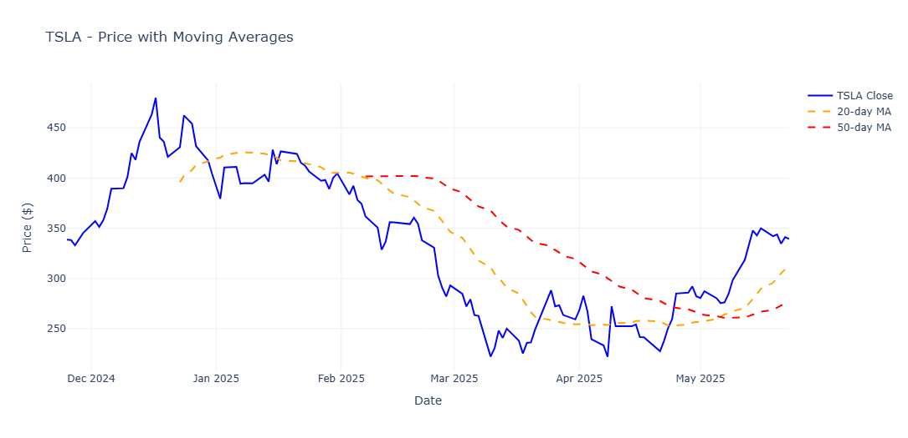

# 📈 Stock Market Dashboard

A Python-based interactive stock market analysis and visualization tool that provides real-time stock data analysis with beautiful, interactive charts. This project demonstrates proficiency in data collection, processing, and visualization using modern Python libraries.

## 🚀 Features

- **Real-time stock data** fetching from Yahoo Finance API
- **Interactive price charts** comparing multiple stocks simultaneously
- **Trading volume analysis** with detailed bar charts
- **Moving averages** (20-day and 50-day) for technical trend analysis
- **Clean, professional visualizations** using Plotly with hover interactions
- **Modular code structure** for easy maintenance and expansion

## 📊 Included Stocks

- **AAPL** - Apple Inc.
- **GOOGL** - Alphabet Inc. (Google)  
- **MSFT** - Microsoft Corporation
- **TSLA** - Tesla Inc.

## 📈 Sample Visualizations

### Stock Price Comparison

*Interactive line chart comparing closing prices of major tech stocks over 6 months*

### Apple Trading Volume

*Bar chart showing Apple's daily trading volume patterns*

### Tesla with Moving Averages

*Tesla stock price with 20-day and 50-day moving averages for trend analysis*

## 🛠️ Technologies Used

- **Python 3.7+** - Core programming language
- **yfinance 0.2.28** - Yahoo Finance API wrapper for real-time data
- **pandas 2.1.3** - Data manipulation and analysis
- **plotly 5.17.0** - Interactive plotting and visualization library
- **streamlit 1.28.1** - Web app framework (future enhancement)

## ⚡ Quick Start

### Prerequisites
- Python 3.7 or higher installed
- Internet connection for data fetching

### Installation & Usage

1. **Clone the repository:**
   ```bash
   git clone https://github.com/ehzl1234/Data-Visualization-Projects.git
   cd Data-Visualization-Projects/src/stock_dashboard
   ```

2. **Install dependencies:**
   ```bash
   pip install -r requirements.txt
   ```

3. **Run the dashboard:**
   ```bash
   python main.py
   ```

4. **View results:** Interactive charts will automatically open in your default browser

### Alternative: Run in Google Colab
For a quick test without local setup, copy the combined code into [Google Colab](https://colab.research.google.com) and run it there!

## 📁 Project Structure

```
stock_dashboard/
├── main.py              # Main dashboard script with visualization functions
├── data_fetcher.py      # Stock data retrieval and processing functions  
├── requirements.txt     # Python package dependencies
├── README.md           # Project documentation (this file)
├── stock_price_comparison.png    # Sample output: Price comparison chart
├── apple_volume_chart.png        # Sample output: Volume analysis
└── tesla_moving_averages.png     # Sample output: Technical indicators
```

## 📸 How It Works

1. **Data Collection**: Uses `yfinance` library to fetch real-time stock data from Yahoo Finance API
2. **Data Processing**: Cleans and structures raw data using pandas DataFrames with proper date indexing
3. **Technical Analysis**: Calculates moving averages and other indicators for trend analysis
4. **Visualization**: Creates interactive charts with Plotly that respond to user hover and click interactions
5. **Display**: Renders charts in browser with professional styling and clear labeling

## 🎯 Key Insights from Current Data

- **Price Trends**: Compare relative performance of major tech stocks over time
- **Volume Analysis**: Identify high-activity trading periods and market sentiment indicators
- **Technical Indicators**: Moving averages help visualize trend direction and potential reversal points
- **Correlation Patterns**: Observe how different tech stocks move in relation to each other

## 🔮 Future Enhancements

- [ ] **Web-based dashboard** with Streamlit for interactive browsing
- [ ] **Additional technical indicators** (RSI, MACD, Bollinger Bands)
- [ ] **Portfolio tracking** functionality with profit/loss calculations
- [ ] **Email alerts** for significant price movements or technical signals
- [ ] **Historical backtesting** capabilities for trading strategies
- [ ] **Cryptocurrency support** for digital asset analysis
- [ ] **News sentiment analysis** integration
- [ ] **Export functionality** for charts and data

## 🔗 Try It Yourself

Want to run this dashboard with your own stock selections? 

1. **Modify the stock list** in `data_fetcher.py` by changing the `DEFAULT_STOCKS` variable
2. **Adjust time periods** by modifying the `period` parameter in `main.py`
3. **Customize visualizations** by editing chart functions in `main.py`

Example: Add cryptocurrency or international stocks:
```python
DEFAULT_STOCKS = ['BTC-USD', 'ETH-USD', 'AAPL', 'NVDA']
```

## 🤝 Contributing

Feel free to fork this project and submit pull requests for improvements! Areas where contributions are especially welcome:
- Additional chart types and technical indicators
- Performance optimizations
- UI/UX improvements
- Documentation enhancements

## 📝 License

This project is open source and available under the [MIT License](LICENSE).

---

**Built with ❤️ for data visualization and financial analysis**
